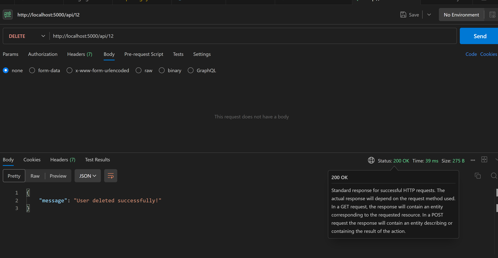

# Format for request

# POST REQUEST
    * Endpoint => https://hng-task-two-a95v.onrender.com/api
    * name attribute in the body of the request, the endpoint accepts only string value.
    * Return: The api returns the message 'User created successfully' with the id of the created user.
    * example with Postman

    

# GET REQUEST
    * Endpoint => https://hng-task-two-a95v.onrender.com/api/:user_id
    * Where :user_id is placeholder for the actual id of the user to get
    * Returns 'User not found!' when a user with id does not exists.
    * Returns the name of the user when user exists.
    * Example usage with Postman

    

# PUT REQUEST
    * Endpoint => https://hng-task-two-a95v.onrender.com/api/:user_id
    * Where :user_id is a placeholder for the actual id of the user to update
    * Returns 'User not found!' when a user with id does not exist.
    * The name attribute should have only string value else 'Only attribute with string value are expected!' is returned
    * Updates the user's name in the database and returns 'User updated successfully!'
    * Example Usage with Postman

    

# DELETE REQUEST
    * Endpoint => https://hng-task-two-a95v.onrender.com/api/:user_id
    * Where :user_id is a placeholder for the actual id of the user to update
    * Returns 'User not found!' when a user with id does not exist.
    * Deletes the user with the associated id in the database
    * Returns 'user deleted successfully' after a successful delete operation
    * Example usage with Postman

    

